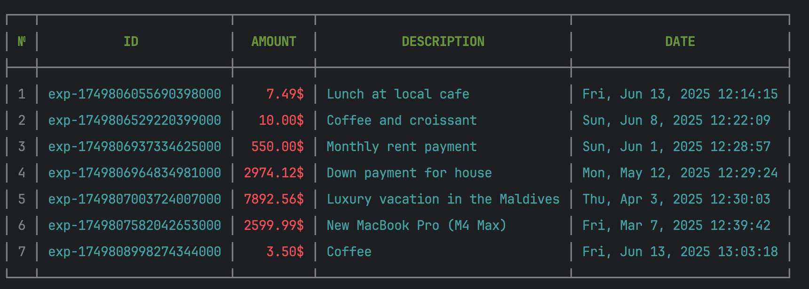

# CLI Expense Tracker 💸

A simple command-line tool to track your expenses directly from the terminal.

---

## 📦 Installation

> Go 1.21+ is required

```bash
git clone https://github.com/Arsiievych/cli-expense-tracker.git
cd cli-expense-tracker
go build -o expense-tracker
```

## ⚙️ Usage

```bash
./expense-tracker [command] [flags]
```

## Available Commands

| Command   | Description               | Examples                                                                      |
|-----------|---------------------------|-------------------------------------------------------------------------------|
| `add`     | Add a new expense         | `./expense-tracker add --desc "Coffee" --amount 3.50`                         |
| `list`    | Show all expenses         | `./expense-tracker list`                                                      |
| `remove`  | Remove item from the list | `./expense-tracker remove --id exp-1749806964834981000`                       |
| `summary` | Summary for a date range  | `./expense-tracker summary -f "2025-06-01 00:00:00" -t "2025-06-30 23:59:59"` |
| `help`    | Show help for any command |                                                                               |

## 📝 Commands and Parameters

## `add` - Add a new expense

- **Required flags:**

  - `--amount, -a` - expense amount (e.g., 9.99)

- **Optional flags:**

  - `--description, -d` - expense description (default: "Other")
  - `--time, -t` - expense date and time (default: current time)
      - Supported date formats:
          - `YYYY-MM-DD HH:mm`
          - `YYYY-MM-DDThh:mm`
          - `YYYY-MM-DD HH:mm:ss`
          - `YYYY-MM-DDThh:mm:ss`

## `list` - View expenses list



## `remove` - Remove an expense
- **Required flags:**
  - `--id` - expense identifier to remove (e.g., exp-1749806964834981000)


## `summary` - Get expenses summary

- **Optional flags:**
  - `--month, -m` - summary for a specific month (format: YYYY-MM, e.g., 2025-06)
  - `--from, -f` - start date for the period (format: YYYY-MM-DD HH:mm:ss)
  - `--to, -t` - end date for the period (format: YYYY-MM-DD HH:mm:ss)

## `help` - Show help for commands

Read more:
https://roadmap.sh/projects/expense-tracker
